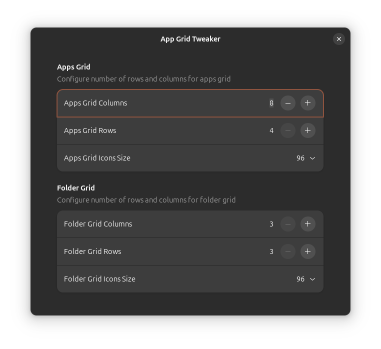

# App Grid Tweaker

<!--  -->

A GNOME Shell extension that allows you to tweak number of rows and columns in the applications grid

### Disclaimer

I've made it first and foremost for my own needs. There are other similar extensions such as `App Grid Tweaks` and `Vertical Workspaces`, but `App Grid Tweaks`, as far as I know, is no longer maintained and not compatible with Gnome 46. As for `Vertical Workspaces` it is well maintained, but it has way too many features that I don't need.

I've tried to fork `App Grid Tweaks` and update it to Gnome 46 GTK/GJS but it didn't work out. So, I decided to write a new extension almost from scratch.

It probably has some bugs, so use it your own risk

### Credits

- [App Grid Tweaks](https://github.com/Selenium-H/App-Grid-Tweaks)
- [Vertical Workspaces](https://github.com/G-dH/vertical-workspaces)
